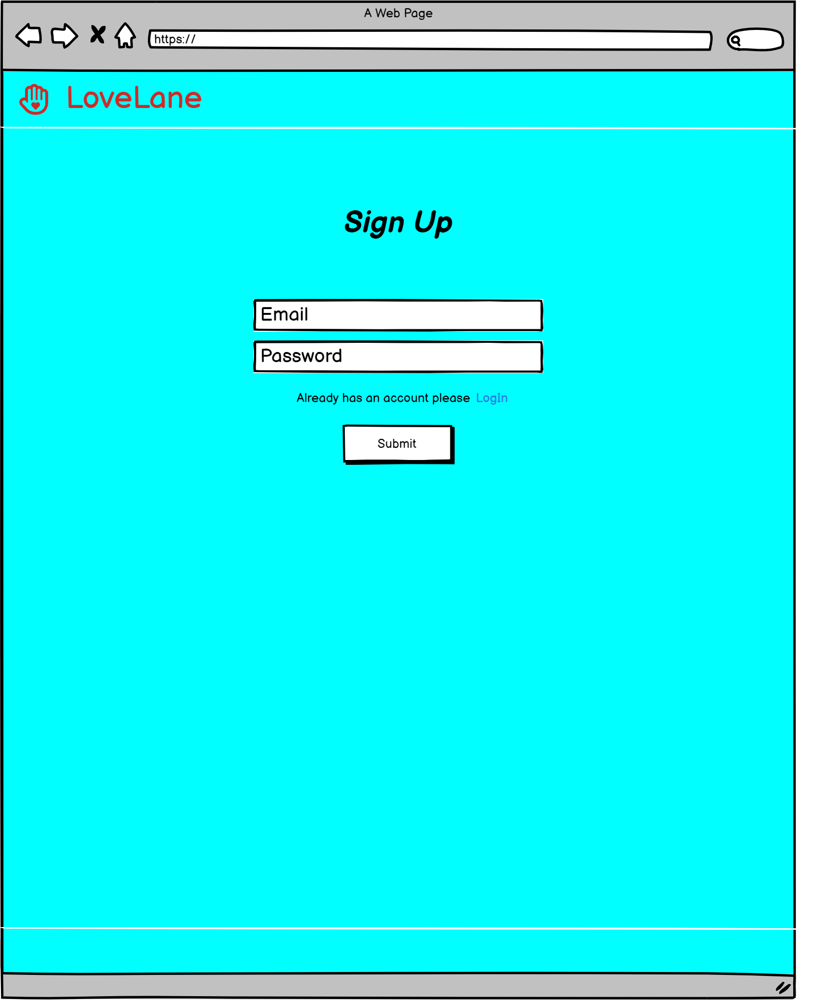
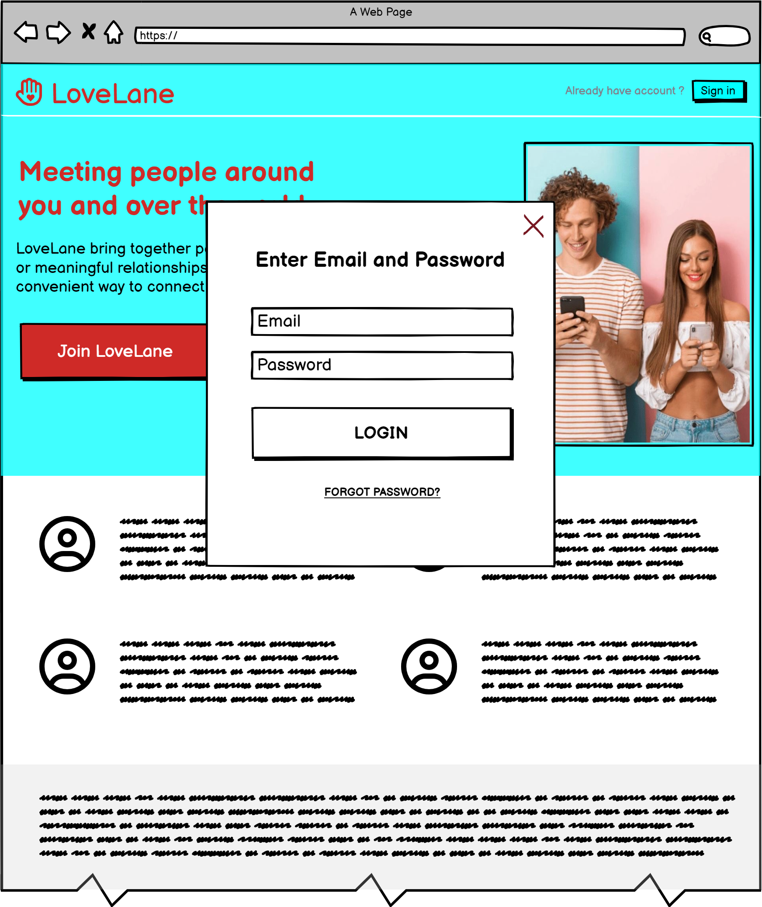
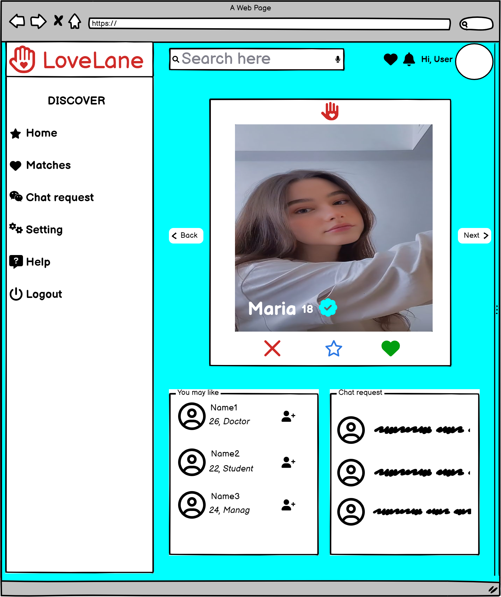
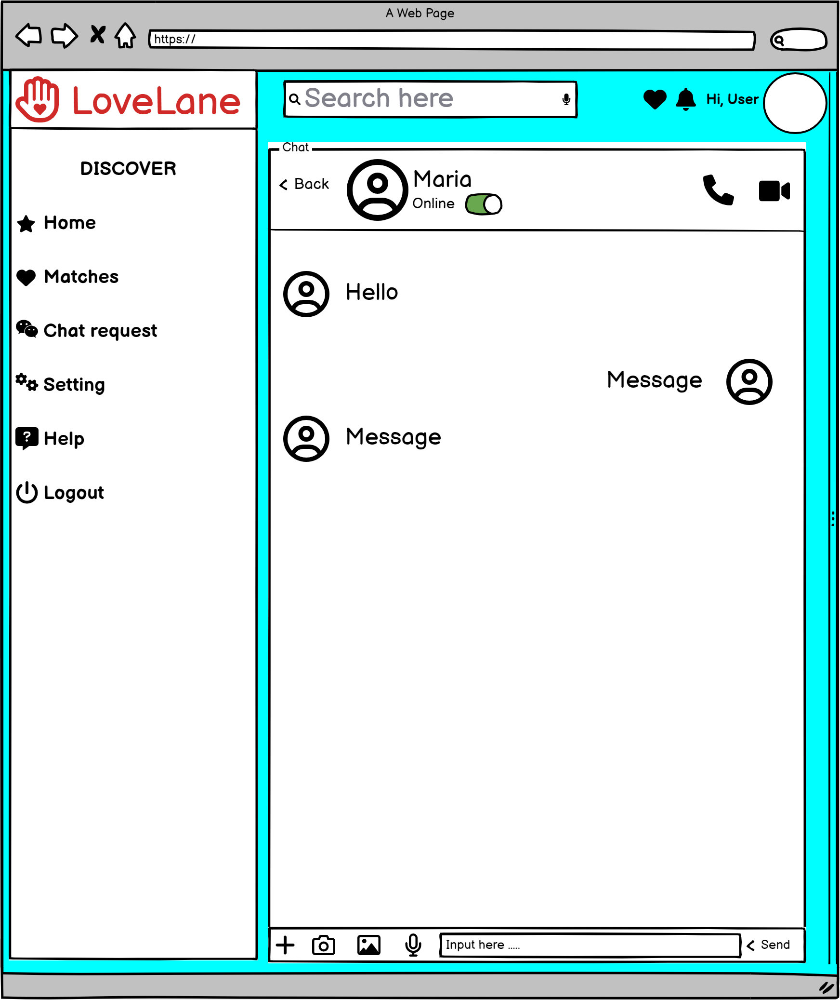

#  💓LoveLane - Assigment PRJ301
## Team Members
- Đỗ Minh Trí SE173029
- Đỗ Nguyễn Bảo Tâm
- Nguyễn Quang Khanh
## Requirement
### 🔥Name of the system

### 🔥Purpose of the system
The goal of LoveLane is to bring together people who are looking for love, friendship, or meaningful relationships and provide them with an easy and convenient way to connect with each other.
### 🔥Who use the system
- People who need help finding compatible partners

### 🔥Features
- Create account
- Edit profile
- View Profile
- Suggest people based on point calculated by hobbies, sex oriented, location and type of relationship
- Match people who like each others
## 🚀Design
### :arrow_forward:**SiteMap** 

### ▶️:**Wireframe**

  
  
  

  
  
  

### ▶️**Database Design**

